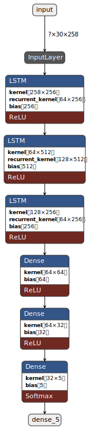

# Gesture Detection using LSTM (Computer Vision Task) 🤖
## Introduction 
### LSTM 🧠

**LSTM (Long Short-Term Memory)** is a type of recurrent neural network (RNN) architecture that is designed to handle the vanishing gradient problem in traditional RNNs. LSTMs are particularly useful for modeling sequential data, such as time series or natural language, where long-term dependencies between inputs are important. The architecture of an LSTM includes a memory cell that can store information over time, as well as input, output, and forget gates that control the flow of information into and out of the cell. This allows LSTMs to selectively remember or forget information from previous inputs, making them well-suited for tasks such as speech recognition, language translation, and gesture detection. 

How to use LSTM for gesture detection ?
--

**Gesture Detection using LSTMs can be done in using two parts**
1. Landmark Detecition 
2. LSTM

Approach
--
First we use Mediapipe Library to extract landmark features of each landmark from input video frames. These include hand and pose landmark features.  
There are total 258 of these landmarks , 68 for each hands and 132 pose landmarks.  
Then we take 30 succesive frames as our data to be trained on .

## File explorer 
Collection of Data
--
`collect.ipynb` to collect multiple 30 frames long videos to be used to train the LSTM  
`Data` Directory contains multiple subdirectories with name of various action. Inside each subdirectory are .npy files of (30,258) dimension. 
Example : the 'forward' directory has 30 .npy files . Each file has 30 frames of 258 Mediapipe landmarks (hence size (30,258)) 
The data has been manually collected.

Processing Data
--
`process.ipynb` Takes the raw .npy data and performs **StratifiedShuffleSplit** on the enitre data to create test and train data such that both test and train have equal representation of all classes.  

Keras model
--
`model_creation_training.ipynb` Creates LSTM model and trains it 
The architechture is given below  

## Final implementation 

`final_detection.ipynb` implements the model .

